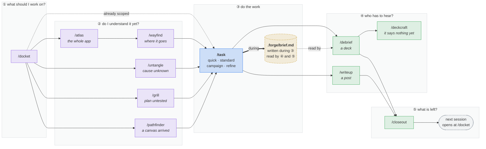
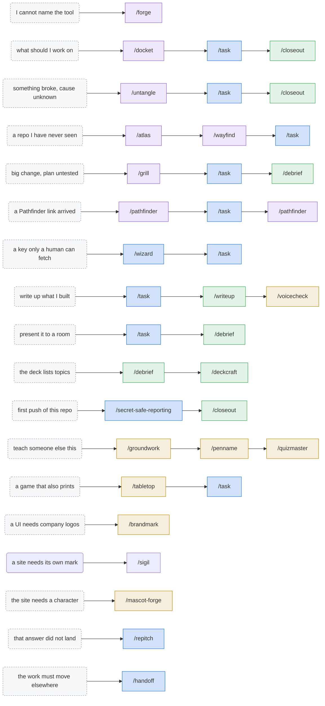

# neorgon-forge

[](https://skills.sh/LucianoAdonis/neorgon-forge)
[](LICENSE)

Skills for finding your way into hard work, taking it on, then explaining it, then keeping the
result consistent.

They are arranged by **where in the work you are**, not by topic, because that is the question
you actually have when you go looking for one.

| Bucket | You are here when |
|---|---|
| **`before/`** | You have not started: which skill, where the change goes, what the problem is, whether the plan holds |
| **`during/`** | The work is happening |
| **`after/`** | It is done and someone has to hear about it |
| **`craft/`** | Standing quality of the fleet, reached for on its own schedule |

## The map

**How a session actually runs.** Five questions in order, and the skills that answer each one.
Only ③ is always there: everything left of it exists so you do not solve the wrong problem,
everything right of it exists so someone else knows what happened.

Most sessions skip most of the boxes. The dotted shortcut is the common case, straight from ①
to ③ when the work is already scoped. `.forge/brief.md` is what makes ④ and ⑤ possible: it is
written *during* the work, so the deck and the post report what happened instead of
reconstructing it from a diff afterwards.



**The combos.** The left column is roughly what you would say out loud; the chain is what to
run. Colours are buckets: `before/` purple, `during/` blue, `after/` green, `craft/` amber.
Every skill appears exactly where it is actually reached for, and six of them are reached for
alone, which is the honest answer rather than an invented chain.



**Start at [`/forge`](docs/skills/forge.md)** when the diagram is not enough. It is the router,
and it carries the one thing a picture cannot: a table resolving every pair of skills that
sound like each other.

### `before/`

| Skill | Use it when | Produces |
|---|---|---|
| **[`forge`](docs/skills/forge.md)** | You can describe the situation but not name the tool | The route, and the reason |
| **[`docket`](docs/skills/docket.md)** | Nothing is in progress and the next thing is unchosen | A slate: small first, questions next, blockers last |
| **[`wayfind`](docs/skills/wayfind.md)** | You do not know where a change goes | `.forge/map.md`: areas, path rules, exceptions |
| **[`untangle`](docs/skills/untangle.md)** | The problem resists a plan | Evidence, or a scored decision, or a coverage map |
| **[`grill`](docs/skills/grill.md)** | The plan needs arguing with before anyone builds | Rounds of questions, `.forge/context.md`, decision records |
| **[`atlas`](docs/skills/atlas.md)** | An app needs docs that can be checked | A dependency model, an MkDocs corpus, and answers |
| **[`pathfinder`](docs/skills/pathfinder.md)** | A Pathfinder canvas, brief or link is in play | A canvas that provably loads, or a patch back into one |

### `during/`

| Skill | Use it when | Produces |
|---|---|---|
| **[`task`](docs/skills/task.md)** | A problem to solve, not an edit to make | Working code, plus `.forge/brief.md` |
| **[`wizard`](docs/skills/wizard.md)** | A step only a human can take | An interactive bash script that walks them through it |
| **[`handoff`](docs/skills/handoff.md)** | The work is moving to another session | `.forge/handoff-<slug>.md`: state, next action, landmines |
| **[`repitch`](docs/skills/repitch.md)** | An answer did not land | The same point, with the context you were missing |
| **[`secret-safe-reporting`](docs/skills/secret-safe-reporting.md)** | Anything touching sensitive data | A boundary design, synthetic fixtures, a pre-push sweep |

### `after/`

| Skill | Use it when | Produces |
|---|---|---|
| **[`debrief`](docs/skills/debrief.md)** | You need to present what changed | A deck, built to PDF (slides YAML, Marp, or Markdown) |
| **[`writeup`](docs/skills/writeup.md)** | You need to publish what changed | `post/POST.md` plus diagrams that cannot drift |
| **[`deckcraft`](docs/skills/deckcraft.md)** | A deck lists topics instead of making a claim | Assertion headings, an order for the room, a lint pass |
| **[`closeout`](docs/skills/closeout.md)** | The work has landed and the question is what is left | A numbered inventory, then the closes one reply authorises |

### `craft/`

| Skill | Use it when | Produces |
|---|---|---|
| **[`penname`](docs/skills/penname.md)** | Prose must sound like the author, not a model | A draft in persona, linted against its ban/cap rules |
| **[`voicecheck`](docs/skills/voicecheck.md)** | Copy needs auditing, aligning, or de-AI-ing | A `file:line` report, or the rewrite |
| **[`groundwork`](docs/skills/groundwork.md)** | A tutorial is about to promise steps | A dated requirements doc, every claim labeled |
| **[`quizmaster`](docs/skills/quizmaster.md)** | Source material should become a runnable exam | Proctor-format JSON, coverage-mapped and validated |
| **[`mascot-forge`](docs/skills/mascot-forge.md)** | A character to generate, cut out, and rig | Aligned frames plus a CSS/physics rig |
| **[`brandmark`](docs/skills/brandmark.md)** | A UI needs recognizable company or service logos | Vendored icons, a letter fallback, and the privacy rule |
| **[`sigil`](docs/skills/sigil.md)** | A site needs its own mark: glyph, accent, favicon set | A linted glyph and six generated files, wired on every page |
| **[`tabletop`](docs/skills/tabletop.md)** | A game must both print and run without drifting | One source for the components, and a measured balance claim |

## Install

Three routes, and which one you want depends on what you are doing rather than on preference.

**As a Claude Code plugin**: the whole set, updated as a unit:

```
/plugin marketplace add LucianoAdonis/neorgon-forge
/plugin install neorgon-forge@neorgon-forge
```

Refresh with `/plugin update neorgon-forge`.

**With the skills CLI**: for one skill, or for an agent other than Claude Code:

```bash
npx skills add LucianoAdonis/neorgon-forge           # all twenty-four
npx skills add LucianoAdonis/neorgon-forge -s atlas   # just one
npx skills add LucianoAdonis/neorgon-forge -l         # list without installing
```

Pass `-g` for user-level rather than project-level. `npx skills` also targets Cursor, Codex and
others, so this is the route that does not assume Claude Code, but it installs skills
individually, so the group is no longer updated as one thing.

**To author them**: clone and symlink, so edits are live with no sync step:

```bash
git clone https://github.com/LucianoAdonis/neorgon-forge
cd neorgon-forge
make install          # symlinks into ~/.claude/skills
```

Then restart Claude Code. `install.sh` prints the slash command for every skill it linked.

Install into one project instead of globally:

```bash
bash bin/install.sh --project ~/code/my-repo
```

`install.sh` refuses to overwrite a real directory that shares a name with one of ours; pass
`--force` to move it aside with a timestamped backup.

**Do not mix the author route with the other two on the same machine.** `make install` symlinks
`~/.claude/skills/<name>` back into this working tree, and both the plugin and `npx skills add`
place their own copy at that name. Whichever lands second wins, and the failure is silent: you
edit the clone and run the copy. Pick one route per machine.

**If a skill is listed but `/<name>` says "Unknown skill"** (observed once with `voicecheck` on a
plugin install): the plugin cache is holding a stale or partial copy. `/plugin update
neorgon-forge`, restart, and if it persists, remove and reinstall the plugin. The skill's
`SKILL.md` being readable in the cache does not prove it registered, invocation is the test.

## Commands

```bash
make install      # symlink skills into ~/.claude/skills
make refresh      # pull, re-link, report drift, validate
make validate     # check every skill against the house standard
make new NAME=my-skill BUCKET=during PURPOSE="what it does"
make status       # what is installed, and from where
```

## The shared brief

`task` maintains `.forge/brief.md` in the repo being worked on:

```
## Problem     what was wrong before: the symptom, not the absence of a fix
## Approach    what you are doing
## Rejected    the alternative that lost, and why
## Decisions   appended as they happen, timestamped
## Measured    numbers actually observed, with how
## Open        deferred work, defects that shipped, decisions left to the user
```

Maintained through a script so the mechanical parts are not the model's problem:

```bash
FORGE=~/.claude   # the directory containing skills/, in this repo plugins/neorgon-forge
bash "$FORGE/skills/task/scripts/brief.sh" init "modal is unreadable on dark backgrounds"
bash "$FORGE/skills/task/scripts/brief.sh" note "rejected raising opacity, the token is shared with 6 sites"
bash "$FORGE/skills/task/scripts/brief.sh" stream add "audit tokens" "find every 3% surface use"
bash "$FORGE/skills/task/scripts/brief.sh" stream done "audit tokens" "9 sites; 2 were intentional"
bash "$FORGE/skills/task/scripts/brief.sh" status
bash "$FORGE/skills/task/scripts/brief.sh" close
```

Why it exists: the three things a deck or post most needs. The symptom before the fix, the
alternative that lost, the number actually measured, are the three things a diff cannot show and
a long session reliably forgets. `close` refuses to quietly drop unfinished workstreams; they
belong under `## Open`.

`.forge/` is shared: `untangle` writes `evidence.md` beside the brief and `wayfind` writes
`map.md`. Add the directory to the worked repo's `.gitignore` if you would rather not commit any of
it. Committing is also reasonable, and the two are worth separating. A brief is a decision record
about one piece of work, while a map is a standing description of the repo that gets more useful
the longer it is kept.

## Scopes, in `task`

Chosen per task and stated out loud, because ceremony on a small task wastes time and a campaign
run as a quick fix produces half a migration.

| Scope | Fits | Delegates |
|---|---|---|
| `quick` | One file, known cause, under ~30 lines | No |
| `standard` | A few files, one subsystem | Research only |
| `campaign` | Many files or subsystems, or spanning sessions | Yes, per workstream |

Campaign delegation has one non-negotiable: **verify against the diff, not the report.** A
subagent reporting success is evidence, not proof. `skills/task/reference/delegation.md` has the
prompt contract and the verification table.

## Authoring new skills

```bash
make new NAME=my-skill BUCKET=during PURPOSE="one-line purpose"
```

Scaffolds the directory, frontmatter, and the section headings that make a skill good, with
`TODO`s rather than plausible filler, because filler gets shipped and questions do not. Pick the
bucket by arc position, not by topic: `before` if the skill runs when you have not started,
`during` while the work happens, `after` when it is done and someone has to hear about it,
`craft` for standing quality reached for on its own schedule.

A new skill owes five things, and `make validate` fails on four of them: the `SKILL.md`, an
`agents/openai.yaml` beside it, an entry in `plugin.json`'s `skills` array, a page at
`docs/skills/<name>.md`, and a line in the **`forge`** router. The last is the one nothing can
check and the one that decides whether the skill is ever reached for. **`CLAUDE.md`** carries
these as maintainer rules; **`.agents/invocation.md`** carries the user-invoked versus
model-invoked test and what each one does to the description.

**`docs/authoring.md`** is the tutorial: when a skill is the right shape at all, how to write the
description (the part that decides whether it ever fires), progressive disclosure across the four
tiers, and how to test that it fires when it should and not when it should not.

## In more detail

Each skill has a page under [`docs/skills/`](docs/skills/) covering what it does, when to reach
for it, and what it looks like when it is working. What follows is the part that does not fit
there: the specific mechanisms, the numbers behind them, and the failure each one was built
against.

### `docket` and `closeout`

The two ends of a session, and the reason they are separate skills is the default they carry.

`closeout` runs when work has landed and something is left over. Its list is **debt already
incurred**, so silence means close it: one reply authorises every item the answer does not
deny, with publishing always its own numbered line so "wrap up" can never imply making a repo
public.

`docket` runs when nothing is in flight and the next thing is unchosen. Its list is a **menu
nobody has committed to**, so silence means leave it alone: only the recommended slate is
default-yes, and everything below it runs solely if the reply names it.

Both refuse to build their list from recollection. Docket reads the prompt queue with each
item's age and line count, every brief's Open section, every workstream still `pending` or
`active`, the harness ledger and git state. The queue it was built against held twenty open
items, fifteen of them one-liners, four of those 174 days old: none hard, and none ever the
thing anybody remembered to do. The line count is the size signal that decides the lane, so an
item that runs to paragraphs is named a campaign and handed to `/task` rather than started.

The ordering rule is the user's, not a heuristic: small items first, then the questions only
they can answer, then blockers, listed but never offered. A blocker cannot be closed in the
session that discovers it, so a session that opens on one buys nothing and spends its momentum.

Its first real run found seven workstreams marked `pending` whose work was plainly finished on
disk, left stale by the session that closed the brief without closing the rows. That is why the
skill treats a ledger entry as a claim to be checked rather than a fact: offering finished work
as the next thing to do discredits the rest of the slate.

### `atlas`

Generates every diagram and doc page from one extracted model rather than beside it, because a
hand-drawn architecture diagram goes stale *silently*. It keeps looking authoritative, and the
first reader to trust it after a refactor gets no warning. `scan.py` records the commit it read
and the `file:line` of every import, so `ask impact <file>` answers "what breaks if I change
this" with citations that can be disproved, and `ask stale` compares the model against git rather
than against mtimes.

Everything it writes lives under one root, `docs/atlas/`. The model, the generated pages, the
exported diagrams, and every page says so in an admonition; everything else in `docs/` is
hand-owned and never touched. One root rather than three because the boundary is only worth
having if a person can hold it in their head. Diagrams follow one rule worth stating on its own:
**shape carries role, colour only emphasises**, and the dependency flowchart draws a spine rather
than every edge: a real app has about twice as many imports as modules, and drawing all of them
produces something that renders, looks impressive, and answers nothing. `reference/mkdocs.md`
holds the verified Material contract, including the two silent failures: a missing
`custom_fences` entry renders a diagram as a code block with no warning at all, and a literal
`\n` in a Mermaid 11 label renders as two characters of text.

### `untangle` and `wayfind`

Both exist because the expensive mistakes happen before any code is written: confident motion in
the wrong direction, and a convention asserted from two files.

**`untangle`** classifies the difficulty first, because the three kinds share almost no technique.
`cause` narrows by refutation: every hypothesis registered with `evidence.sh` must carry the
observation that would kill it, since a theory nothing could disprove cannot be crossed off and
quietly becomes the assumption everything else rests on. `design` scores real options against
criteria written *before* the options. `scale` builds a coverage map with `survey.sh` and hands
execution to `task --scope campaign`. It also has a stop condition: three refuted hypotheses with
nothing confirmed is a report, not a state to persist in.

**`wayfind`** makes every claim about a codebase carry its basis. `map.sh rule` refuses a rule
without one, because "it seems standard" and "census: 41 files, no exceptions" read identically
next session and only one of them is true. `ticket` resolves a ticket's vocabulary to ranked
candidate files, `resolve` reports which rules and recorded exceptions govern a path, and `check`
flags rules whose glob now matches nothing. A dead rule is worse than a missing one, because a
missing rule prompts a question and a dead one answers it wrongly.

### `grill`

The third `before/` skill, and the one that covers the case the other two do not: the plan is
stated, the problem is understood, and nobody has argued with it yet.

It collapses three separate ideas into one skill. Asking a whole **frontier** of questions per
round rather than one at a time, because a plan with fourteen open decisions becomes fourteen
exchanges otherwise and the user quits at six. Recommending an answer to every question, so the
user is editing rather than composing. And detecting the repo, so the same interview leaves a
paper trail (`.forge/context.md` plus numbered decision records) where there is somewhere to
leave one, and leaves nothing where there is not. It says which of the two it is doing before
the first round, because a user who expected a paper trail and got none finds out at the end.

`reference/paper-trail.md` holds both formats and the rule that keeps them useful: the
`_Avoid_` line is the load-bearing part of a glossary entry, and a decision record is written
only when undoing the decision would be expensive. A directory of forty decision records has
none, because nobody reads forty.

### `wizard`, `handoff` and `repitch`

The three `during/` additions, each covering a moment the rest of the set walks past.

**`wizard`** generates a bash script for the steps only a human can take. Everything above the
`STAGES` marker in `scripts/template.sh` is identical in every wizard it writes: stage progress,
confirmation gates, cross-platform URL opening including WSL, hidden secret entry, idempotent
`.env` upserts, `gh secret` writes, a closing summary. That sameness is what lets a reviewer
read the stages and trust the rest. The idempotent upsert is the part that earns its place: it
is what makes a run that failed at stage four recoverable without retyping stages one to three.
It is verified statically rather than by running it, since it opens browsers and blocks on human
input, and the check that matters is that every `set_secret` name matches its `secrets.*`
reference exactly, because CI reports a mismatch as an empty string rather than an error.

**`handoff`** compacts a session into `.forge/handoff-<slug>.md`, beside the brief rather than
in a temp directory, so the next agent opens one directory and finds everything. Its rule is
that artifacts are referenced and never copied: if the brief already records the rejected
approach, the handoff points at it. That is what keeps it under a page, and what stops two
copies of one decision drifting until nobody can tell which is current. Its landmines section
is the part a diff cannot provide, and it is written even when it is unflattering, because an
omitted failed approach gets retried by the next agent at full cost.

**`repitch`** is the smallest thing here and the one used most often. An answer did not land;
the agent re-explains, leading with the context it was standing on that you were not, in plain
language, using `.forge/context.md`'s vocabulary where one exists. It assumes the gap was
missing context rather than missing intelligence, which is why it is not simply the same
paragraph more slowly.

### `voicecheck` and `penname`

**`voicecheck`** loads a voice before judging one. A per-project `VOICE.md` overrides a checkable
baseline; with neither, an audit is just an opinion about someone else's writing. `audit` reports
`file:line` and never writes, `align` applies the fixes, `detox` strips only the AI tells, and
`diff` compares two projects: the one command that can see drift, since drift is invisible from
inside a single repo.

### `mascot-forge`

Two halves that fail differently. Generation fails by *drifting*, so frames
stop layering; animation fails by looking *pasted on*. Its scripts run from the target project's
root and write into `./images/mascot/`, so one install serves every project. Art generation needs
`GEMINI_API_KEY`; `keys.py` is the only place that reads a key, and it never prints one.

**`sigil`** is the other half of `brandmark`: that one borrows someone else's logo, this one
authors the project's own. Its content is the judgement neither the kit README nor the icon
lint can hold, which is *which drawing to choose*, decided at 16 pixels and measured rather
than argued: ink above 55% of a glyph's own bounding box reads heavy at any size, and zero
enclosed counters at that size means the drawing has closed into a blob unless it is open by
construction. The monorepo's own `new-project` and `add-to-hub` commands call it, so a site is never
born without a mark.

**`penname`** is voicecheck's drafting half. Where voicecheck audits copy that exists, penname
writes new prose under one of five personas, `ironic` (the author's public voice, toned down),
`medium-es` (the Spanish one, full strength, for a LatAm tech audience), `briefing` (for people
who decide, not build), `fieldnote` (engineer-to-engineer evidence), `tutorial` (hands-on-keyboard
instructions). Each persona is a corpus-derived file whose rules are numbers, not adjectives, and
`persona-lint.sh` enforces the ban/cap list before anything is delivered. The failure mode it
prevents runs both directions: drifting into a generic model voice, or imitating the author's tics
so hard the register collapses into parody.

`medium-es` is the one persona that also ships a **feedback ledger**, and the reason is its
provenance: it was distilled from a single long editing session over two Spanish finals rather
than from nineteen finished posts, so its evidence is thinner and still moving. `feedback/` holds
the rules the author actually accepted or rejected on top of the persona, and it outranks the
persona where they disagree, because it is newer evidence. `feedback-add.sh` appends one distilled
rule and refuses a near-duplicate. It compares significant words, so it catches a restatement and
not a paraphrase, which is why it prints the whole section back and tells you to read it rather
than claiming the ledger is clean.

### `groundwork` and `quizmaster`

**`groundwork`** comes before any tutorial that promises steps. It walks the acquisition path
(sign-up → credential → first successful call), provokes limits rather than reading about them
where it can, and emits a requirements doc where every claim is labeled `verified`, `documented`,
or `inferred`: with a date, because a limit without a date is a rumor. Dead ends ship verbatim;
they are the tutorial's Gotchas section, pre-written. Two scripts keep the doc honest after it
ships: `docrun.sh` executes a doc's fenced bash blocks in order, in one shell, and reports the
first failing block (a tutorial that proves itself, safe by default, listing unless `--run`),
and `stale.sh` reports every dated claim past a threshold, because `verified` expires.

**`quizmaster`** turns source material into an exam for the [Proctor](https://proctor.neorgon.com)
runner: coverage map before questions, one discriminator per stem, distractors drawn from real
misconceptions, an explanation that teaches on every question, and `validate-exam.mjs`, which
checks the JSON against the format (answer keys in range, exact-set multi answers, no duplicate
options) so a plausible-looking exam that would misgrade is caught before a human loads it.

**penname's `shipcheck.sh`** closes the writing loop: the author's own "ship it" checklist
mechanized: structure (title, hook, headings, example, gotchas, ending) plus rot (every link
answering, every local image existing).

### `deckcraft`

`debrief` turns a finished diff into a deck. **`deckcraft`** handles every other deck: one written
from an idea, or one that already exists and is not landing. It targets the failure the
[slides-site](https://slides.neorgon.com) audit is structurally unable to see. That audit enforces
density, and density is not meaning: across that project's own twelve example decks, three
independent passes agreed that 2 of 48 content headings state a claim. The other 46 name a
subject, which is a filing system with a theme on it.

So the skill inverts the writing order. Headings first, every one an assertion you could disagree
with, and the bullets become evidence for the heading rather than the thing the heading
summarises. Usually this is a rewrite and not new writing: in nine of twelve real decks the claim
was already sitting one field lower, in `subtitle:` or `caption:` or `note:`, set smaller than the
label above it.

`deck-lint.sh` reports what `validate.mjs` structurally cannot: topic-label headings, a heading
asserting a number the slide never shows, promised links that do not exist, unlabelled comparison
columns, missing alt text. `reference/rooms-and-exports.md` carries the part that only matters
once a deck leaves the browser: minimum legible size by viewing distance, and exactly what each
export path drops on the way out.

### `secret-safe-reporting`

Any pipeline that classifies sensitive data and reports on it will, by default, leak the data
into the report: in fixtures, in "sample value" tables, in git history. The skill carries one
architectural rule (classify at the trust boundary, propagate the verdict, never the input) and
the mechanical checks that make it hold: classifier ordering where deny-by-name outranks
allow-by-family, synthetic same-shape fixtures instead of observed values, a canary suite with a
negative control, and `sweep.sh`: a pre-publish tripwire that scans the tree, the index, and
(before a first push) the whole history for credential-shaped content, reporting `file:line` and
never the value itself. The same architecture serves PII in analytics, user content in error
reports, and prompt text in LLM traces; only the shape vocabulary changes.

## Portability

Portable core, overlay for local convention. Each `SKILL.md` works in any repo; anything true
only of the Neorgon monorepo: the `slides-site` deck player, the brand palette, the suite chrome
strings: sits in `reference/neorgon.md` behind a detection step. `debrief` emits slides YAML when
it finds the player at `projects/slides-site/` **or** `slides-site/`, and falls back to Marp or
Markdown when it does not; `voicecheck` prints its overlay only when it actually detects the suite.

A detection step is tested against every layout it claims to support, because these gates fail
closed: when the monorepo moved its sites under `projects/`, `debrief`'s single-path test stopped
matching and the skill silently degraded to plain Markdown without erroring once.

## Layout

```
neorgon-forge/
├── CLAUDE.md                           # maintainer invariants: what a new skill owes
├── .claude-plugin/marketplace.json     # so /plugin marketplace add works
├── .agents/
│   ├── invocation.md                   # user-invoked vs model-invoked, and the test
│   ├── writing-docs.md                 # the four-section frame every docs page uses
│   └── decisions/                      # why the repo is shaped this way
├── docs/
│   ├── authoring.md                    # how to write a skill
│   └── skills/<name>.md                # one human-facing page per skill (flat, 18)
├── plugins/neorgon-forge/
│   ├── .claude-plugin/plugin.json      # ships exactly the skills its array lists
│   └── skills/
│       ├── before/
│       │   ├── forge/      SKILL.md                       (the router)
│       │   ├── wayfind/    SKILL.md, scripts/{orient,map}.sh, reference/tickets.md
│       │   ├── untangle/   SKILL.md, scripts/{evidence,survey}.sh, reference/hypotheses.md
│       │   ├── grill/      SKILL.md, reference/paper-trail.md
│       │   └── atlas/      SKILL.md, scripts/*.py + render.sh, reference/mkdocs.md
│       ├── during/
│       │   ├── task/       SKILL.md, scripts/brief.sh,
│       │   │               reference/{delegation,hazards,deep-modules}.md
│       │   ├── wizard/     SKILL.md, scripts/template.sh
│       │   ├── handoff/    SKILL.md
│       │   ├── repitch/    SKILL.md
│       │   └── secret-safe-reporting/  SKILL.md, scripts/sweep.sh, reference/shapes.md
│       ├── after/
│       │   ├── debrief/    SKILL.md, scripts/collect-changes.sh, reference/
│       │   ├── writeup/    SKILL.md, scripts/{check-writeup,diagram-kit,rasterize}
│       │   └── deckcraft/  SKILL.md, scripts/deck-lint.sh, reference/rooms-and-exports.md
│       └── craft/
│           ├── penname/    SKILL.md, personas/*.md, feedback/, scripts/*.sh
│           ├── voicecheck/ SKILL.md, scripts/load-voice.sh, reference/voice-defaults.md
│           ├── groundwork/ SKILL.md, scripts/{docrun,stale}.sh, reference/
│           ├── quizmaster/ SKILL.md, scripts/validate-exam.mjs, reference/
│           └── mascot-forge/ SKILL.md, scripts/*.py, assets/, reference/prompts/
├── bin/{install,refresh,validate,new}.sh
└── Makefile
```

Every skill also carries `agents/openai.yaml` beside its `SKILL.md`, so it has an identity in
Codex and other harnesses rather than only in Claude Code.

**The bucket is repo organisation only.** Skills install **flat**, into
`~/.claude/skills/<name>/`, so a cross-skill path written in prose never carries a bucket:
`skills/task/scripts/brief.sh`, never `skills/during/task/scripts/brief.sh`. `bin/validate.sh`
resolves those by searching the buckets, which is the only reason the two layouts can safely
disagree.

## What `make validate` enforces

The checks exist because each one has caught something. It fails, not warns, on:

- A **model-invoked description** under 300 characters, or with no trigger phrases, or with no
  statement of what the skill is *not* for. That string is the entire routing decision.
- A **user-invoked description** over 320 characters, or carrying trigger phrases. Nothing can
  ever act on those, so they are noise in the one place a human reads closely.
- **Invocation disagreeing across harnesses**: `disable-model-invocation` set without
  `policy.allow_implicit_invocation: false`, or the reverse. A skill closed in one harness and
  open in the other is reachable through the gap.
- A **missing `agents/openai.yaml`**, or a **missing docs page**.
- **`plugin.json` and the skills tree disagreeing.** The plugin ships exactly what the array
  lists, so a skill missing from it is installed by nobody.
- A script **writing outside the sanctioned roots** (`.forge/`, `docs/atlas/`, `post/`,
  `images/`, plus two argued exceptions).
- An **em dash** in any prose, excluding a line that quotes the character as a glyph in order to
  ban it.
- A dead `reference/` or `scripts/` link, a non-executable script, a syntax error, a committed
  key, a hardcoded home path. A path in the **worked repo** is written `./scripts/x` and is
  skipped, which is how a skill names the tools of the repo it operates on without lying.

Everything above judges one skill alone. The last group, in `bin/coverage.py`, judges the
**set**, which is where the drift that actually happened lives: four skills were added in one
week, the router picked up three of them, the README none. It fails on:

- A skill **absent from the router**, from the **README**, or from the **README's diagrams**.
  The last one is separate on purpose: a bucket-table row satisfies the second check while
  leaving the new skill off the picture everyone actually reads.
- A **docs page with no skill**, left behind by a rename.
- A **relative link that resolves to nothing**. This found a docs page linking to
  `impeccable.md`, a skill that lives outside this plugin and so can never have a page here.
- A **node on the map coloured as the wrong bucket**, which is worse than an uncoloured one:
  it asserts something false rather than saying nothing.
- A **`/<command>` that resolves to nothing**, which is how a combos diagram outlives a rename.
- A **stated skill count that disagrees with the tree**. Four claim shapes are recognised
  (`N skills`, `all N`, `over the N`, `N is more than`); a looser rule fired on "owes five
  things" and was narrowed, because a checker that misfires on good prose is one you learn to
  switch off.

## License

MIT
